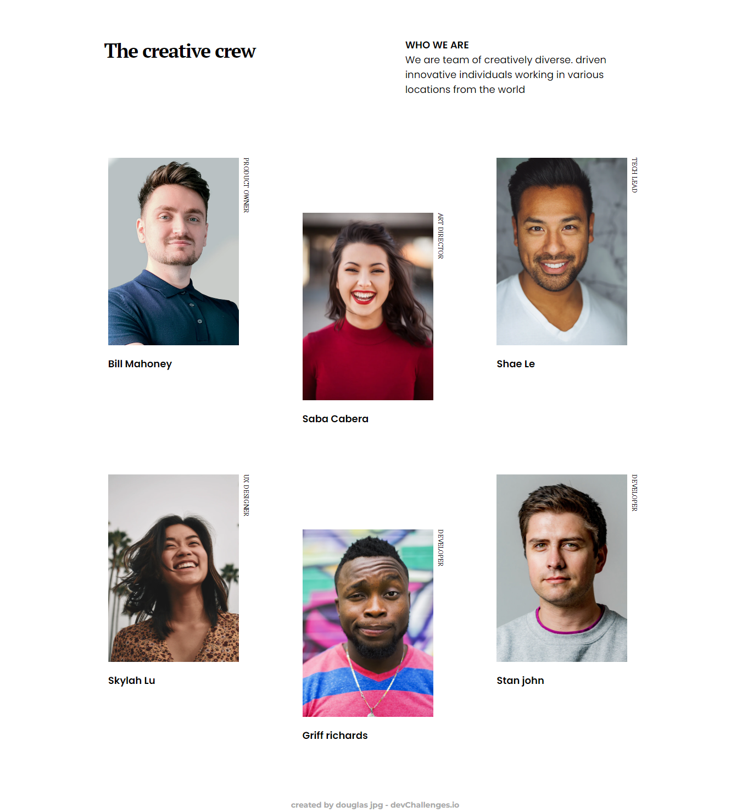

<h1 align="center">My team page master</h1>

   Solution for a challenge from  <a href="http://devchallenges.io" target="_blank">Devchallenges.io</a>.

  <h3>
    <a href="https://douglas-jpg.github.io/My-team-page-master/">
      Demo
    </a>
     | 
    <a href="https://devchallenges.io/solutions/k199egJg3NMh0IFteB2o">
      Solution
    </a>
     | 
    <a href="https://devchallenges.io/challenges/hhmesazsqgKXrTkYkt0U">
      Challenge
    </a>
  </h3>

## Table of Contents

- [Overview](#overview)
- [Features](#features)
- [Contact](#contact)

<!-- OVERVIEW -->

## Overview

## Features

This application/site was created as a submission to a [DevChallenges](https://devchallenges.io/challenges) challenge. The [challenge](https://devchallenges.io/challenges/wBunSb7FPrIepJZAg0sY) was to build an application to complete the given user stories.

## Contact

- GitHub [@douglas-jpg](https://github.com/douglas-jpg)
- Twitter [@D0ug45](https://https://twitter.com/D0ug45)
